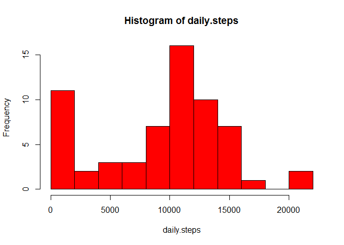
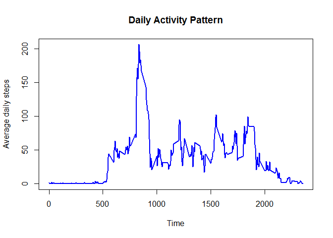
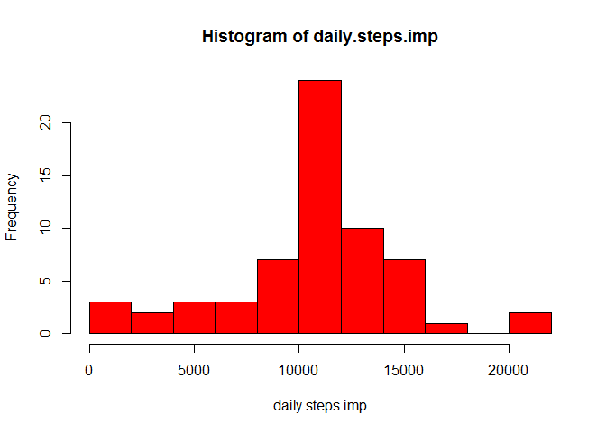
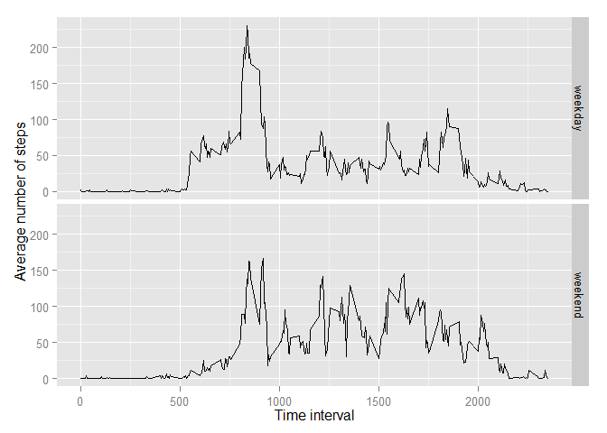

# Reproducible Research: Peer Assessment 1

This is a literate statistical programming document describing an exploratory analysis of a personal activity monitoring dataset. The data are from a pedometer. The work is submitted as a programming assignment for the Coursera class Reproducible Research.


## Loading and preprocessing the data

The data are present in the [forked repository][1] in a zip archive. Before proceeding, check the working directory is a good location: C:/Users/Jason/Source/Repos/RepData_PeerAssessment1. Then unpack the archive.


```r
unzip("activity.zip")
```

This produces a single file called `activity.csv`. Read this into a data frame called `activity`. 


```r
activity <- read.csv("activity.csv")
```

Next I explore the general state of the data, to see what cleaning may need to be done.


```r
print(xtable(tail(activity,10)),type="html")
```

<!-- html table generated in R 3.1.2 by xtable 1.7-4 package -->
<!-- Fri Feb 20 09:49:11 2015 -->
<table border=1>
<tr> <th>  </th> <th> steps </th> <th> date </th> <th> interval </th>  </tr>
  <tr> <td align="right"> 17559 </td> <td align="right">  </td> <td> 2012-11-30 </td> <td align="right"> 2310 </td> </tr>
  <tr> <td align="right"> 17560 </td> <td align="right">  </td> <td> 2012-11-30 </td> <td align="right"> 2315 </td> </tr>
  <tr> <td align="right"> 17561 </td> <td align="right">  </td> <td> 2012-11-30 </td> <td align="right"> 2320 </td> </tr>
  <tr> <td align="right"> 17562 </td> <td align="right">  </td> <td> 2012-11-30 </td> <td align="right"> 2325 </td> </tr>
  <tr> <td align="right"> 17563 </td> <td align="right">  </td> <td> 2012-11-30 </td> <td align="right"> 2330 </td> </tr>
  <tr> <td align="right"> 17564 </td> <td align="right">  </td> <td> 2012-11-30 </td> <td align="right"> 2335 </td> </tr>
  <tr> <td align="right"> 17565 </td> <td align="right">  </td> <td> 2012-11-30 </td> <td align="right"> 2340 </td> </tr>
  <tr> <td align="right"> 17566 </td> <td align="right">  </td> <td> 2012-11-30 </td> <td align="right"> 2345 </td> </tr>
  <tr> <td align="right"> 17567 </td> <td align="right">  </td> <td> 2012-11-30 </td> <td align="right"> 2350 </td> </tr>
  <tr> <td align="right"> 17568 </td> <td align="right">  </td> <td> 2012-11-30 </td> <td align="right"> 2355 </td> </tr>
   </table>

```r
print(xtable(summary(activity)), type="html")
```

<!-- html table generated in R 3.1.2 by xtable 1.7-4 package -->
<!-- Fri Feb 20 09:49:11 2015 -->
<table border=1>
<tr> <th>  </th> <th>     steps </th> <th>         date </th> <th>    interval </th>  </tr>
  <tr> <td align="right"> 1 </td> <td> Min.   :  0.0   </td> <td> 2012-10-01:  288   </td> <td> Min.   :   0   </td> </tr>
  <tr> <td align="right"> 2 </td> <td> 1st Qu.:  0.0   </td> <td> 2012-10-02:  288   </td> <td> 1st Qu.: 589   </td> </tr>
  <tr> <td align="right"> 3 </td> <td> Median :  0.0   </td> <td> 2012-10-03:  288   </td> <td> Median :1178   </td> </tr>
  <tr> <td align="right"> 4 </td> <td> Mean   : 37.4   </td> <td> 2012-10-04:  288   </td> <td> Mean   :1178   </td> </tr>
  <tr> <td align="right"> 5 </td> <td> 3rd Qu.: 12.0   </td> <td> 2012-10-05:  288   </td> <td> 3rd Qu.:1766   </td> </tr>
  <tr> <td align="right"> 6 </td> <td> Max.   :806.0   </td> <td> 2012-10-06:  288   </td> <td> Max.   :2355   </td> </tr>
  <tr> <td align="right"> 7 </td> <td> NA's   :2304   </td> <td> (Other)   :15840   </td> <td>  </td> </tr>
   </table>

```r
nrow(activity)
```

[1] 17568

The `steps` variable has 13.1148 percent missing values. This will be explored more later.

The `interval` is a numeric type, but it represents time in 24-hour format. If the number is padded with zeros, it will be easy to convert to a time format.  This can be combined with the character representations of the dates in a single POSIXlt field. I will retain the original `interval` as it will be useful later.


```r
activity$timeChar <- sprintf("%04d", activity$interval)
activity$posix <- strptime(paste(activity$date, activity$timeChar), 
                                 format="%Y-%m-%d %H%M")
summary(activity$posix)
```

```
##                  Min.               1st Qu.                Median 
## "2012-10-01 00:00:00" "2012-10-16 05:58:45" "2012-10-31 11:57:30" 
##                  Mean               3rd Qu.                  Max. 
## "2012-10-31 12:23:59" "2012-11-15 17:56:15" "2012-11-30 23:55:00"
```

```r
activity$timeChar <- NULL
activity$date <- NULL
```

## What is mean total number of steps taken per day?

To compute the daily number of steps, I first total each day's count of steps. Then I take the mean and median of each daily observation.  First, we observe the histogram of the daily steps taken. 


```r
daily.steps<- tapply(activity$steps, cut.POSIXt(activity$posix,"day"), sum, na.rm=T)
hist(daily.steps, col="red",breaks=12)
```

 

```r
mean(daily.steps)
```

```
## [1] 9203
```

```r
median(daily.steps)
```

```
## [1] 10350
```

## What is the average daily activity pattern?

To understand the average daily activity pattern, I produce a time series plot of and the average number of steps taken against the 5-minute interval.  For this the original `interval` value is used.


```r
interval.steps <- tapply(activity$steps, activity$interval, mean, na.rm=T)

plot(interval.steps,x=names(interval.steps), type="l",xlab="Time", ylab="Average daily steps",main="Daily Activity Pattern", lwd=2, col="blue")
```

 

The plot shows a diurnal pattern: much more activity during the day. The steps begin early in the morning, peak in mid morning, and have a few local surges through the afternoon and evening. The average drops off in the late evening. The interval with the maximum number of steps can be found. 


```r
names(which.max(interval.steps))
```

```
## [1] "835"
```

This is interpreted as the 8:35 AM to 8:39:59 AM interval. It has 206.1698 on average each day in a five-minute period. 

## Imputing missing values

As mentioned above, there are days and intervals with missing values.  The number of missing values is: 

The number of rows containing NAs is:

```r
sum(is.na(activity$steps))
```

```
## [1] 2304
```

```r
sum(is.na(activity$posix))
```

```
## [1] 0
```

```r
sum(is.na(activity$interval))
```

```
## [1] 0
```
Observe only `steps` contains missing values. The pedometer device has produced a record for each time stamp. 


In order to fill in the missing values, I impute the missing value as the mean of its five-minute interval. First, I construct a data frame containing the intervals and their means across observed days. Second this is merged with the `activity` data frame to make imputed values available. Finally I fill in the missing values with the interval mean.


```r
interval.steps.df <- data.frame(interval=as.numeric(names(interval.steps)),
                                mean.steps = interval.steps)
impute <- merge(activity, interval.steps.df, by="interval")
impute[is.na(impute$steps),"steps"] <-impute[is.na(impute$steps), "mean.steps"] 
```

For comparison to the original data, I repeat here the histogram, mean and median of total daily steps, this time with imputed steps.


```r
daily.steps.imp <- tapply(impute$steps, cut.POSIXt(impute$posix,"day"), sum)
hist(daily.steps.imp, col="red",breaks=12)
```

 

```r
mean(daily.steps.imp)
```

```
## [1] 10593
```

```r
median(daily.steps.imp)
```

```
## [1] 10755
```

```r
mean.diff <- mean(daily.steps.imp) - mean(daily.steps) 
med.diff <- median(daily.steps.imp) - median(daily.steps)
```

The mean increased by 1389.1856 steps and the median increased by 405.0566 steps.  It makes sense these measures of central tendency increase because steps are now assumed to happen where none were recorded originally.  


## Are there differences in activity patterns between weekdays and weekends?
I explore this question using the dataset with imputed step count values. The POSIX date data provides easy access to the day of the week. Sunday is coded as zero and Saturday is 6.  I create the new factor using the `wday` member of the POSIXlt date.


```r
impute$weekend <- as.factor(impute$posix$wday %in% c(0,6))
levels(impute$weekend) <- c("weekday","weekend")
```


I compare the weekday and weekend time series of daily average steps for weekday and weekend to address the question.  First, I summarize the data using the `reshape2` package. The panel plot is displayed below.


```r
weekend.int<- dcast(melt(impute,measure.vars="steps"),interval+weekend~variable,mean)
p <- ggplot(weekend.int,aes(x=interval,y=steps, group=weekend))
p + geom_line() + facet_grid(weekend ~ .) + xlab("Time interval") + ylab("Average number of steps")
```

 

On the weekends, activity begins later, more slowly and does not peak as high. It is also more irregular and carries on later than in the weekdays.


[1]:https://github.com/rdpeng/RepData_PeerAssessment1
